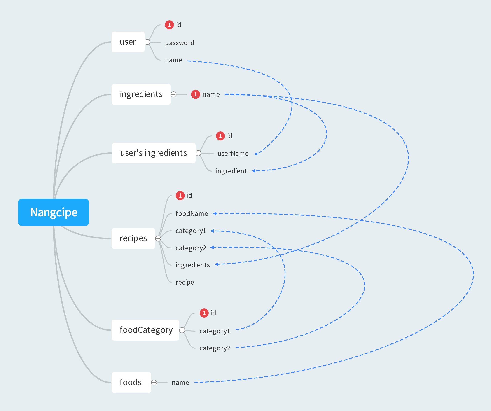

# Nangcipe

- 제주대학교

  컴퓨터공학전공

  2022년 1학기 SW융합캡스톤디자인3

  

- 팀 이름 : Legeno

  팀장 : 양성원

  팀원 : 이현수, 김세훈, 박병민

  

- 프로젝트명 : 냉시피를 부탁해

- dev env
  - node.js
  - yarn
  - express
  - react
  - MySQL
    - mysql
    - mysql-client
- libraries
  - frontend
    - 프로젝트 진행 중 설치하는 라이브러리 모두 적기
  - backend
    - nodemon
    - express
    - express-generator
    - mysql2
    - mysql/promise
      - 동기/비동기 처리를 위해서 promise 사용
- Modelling

- 데이터

농식품 빅데이터 거래소 https://kadx.co.kr/product/detail/0c5ec800-4fc2-11eb-8b6e-e776ccea3964

공공데이터포털 http://www.foodsafetykorea.go.kr/api/openApiInfo.do?menu_grp=MENU_GRP31&menu_no=661&show_cnt=10&start_idx=1&svc_no=COOKRCP01

위키백과 https://namu.wiki/w/%ED%95%9C%EA%B5%AD%20%EC%9A%94%EB%A6%AC/%EB%AA%A9%EB%A1%9D
